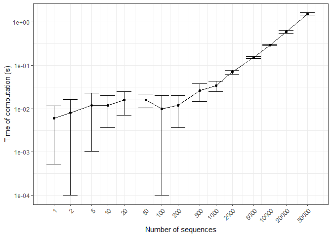

<!-- README.md is generated from README.Rmd. Please edit that file -->

# Mixture of Markov Chains with Support of Higher Orders and Multiple Sequences

<!-- badges: start -->

[](https://lifecycle.r-lib.org/articles/stages.html#experimental)
[](https://CRAN.R-project.org/package=markovmix)
[](https://github.com/zhuxr11/markovmix/actions)
[](https://app.codecov.io/gh/zhuxr11/markovmix?branch=master)
[](https://cran.rstudio.com/web/packages/markovmix/index.html)
<!-- badges: end -->

**Package**: [*markovmix*](https://github.com/zhuxr11/markovmix)
0.1.2<br /> **Author**: Xiurui Zhu<br /> **Modified**: 2023-04-29
13:41:56<br /> **Compiled**: 2023-04-29 13:42:00

The goal of `markovmix` is to fit mixture of Markov chains of higher
orders from multiple sequences. It is also compatible with ordinary
1-component, 1-order or single-sequence Markov chains. Various utility
functions are provided to derive transition patterns, transition
probabilities per component and component priors. In addition,
`print()`, `predict()` and component extracting/replacing methods are
also defined as a convention of mixture models.

## Installation

You can install the released version of `markovmix` from
[CRAN](https://cran.r-project.org/) with:

``` r
install.packages("markovmix")
```

Alternatively, you can install the developmental version of `markovmix`
from [github](https://github.com/) with:

``` r
remotes::install_github("zhuxr11/markovmix")
```

## Examples of fitting (mixture of) Markov chains

Before start, we generate some sequences with a finite set of states,
just as those to fit a Markov chain.

``` r
library(markovmix)
```

``` r
library(purrr)
#> 
#> Attaching package: 'purrr'
#> The following object is masked from 'package:testthat':
#> 
#>     is_null

# Define Markov states
mk_states <- LETTERS[seq_len(4L)]
# Define number of sequences
mk_size <- 100L
# Define sequence length range
mk_len_range <- seq_len(10L)
# Define a helper function to generate sequence list
gen_seq_list <- function(size, len_range, states, seed = NULL) {
  if (is.null(seed) == FALSE) {
    set.seed(seed)
  }
  purrr::map(seq_len(size), ~ sample(states, sample(len_range, 1L), replace = TRUE))
}
mk_seq_list <- gen_seq_list(size = mk_size, len_range = mk_len_range, states = mk_states, seed = 1111L)
head(mk_seq_list)
#> [[1]]
#> [1] "B" "B" "D" "A" "B" "B"
#> 
#> [[2]]
#>  [1] "C" "C" "D" "C" "C" "A" "A" "B" "D" "B"
#> 
#> [[3]]
#> [1] "C" "A"
#> 
#> [[4]]
#> [1] "A"
#> 
#> [[5]]
#> [1] "A" "D" "B" "B"
#> 
#> [[6]]
#> [1] "A" "B"
```

First, we fit a 1-order Markov chain, the most commonly used type.

``` r
mk_fit <- fit_markov_mix(seq_list = mk_seq_list, states = mk_states)
#> Fitting Markov chain with a single (non-mixture) component ...
print(mk_fit)
#> This is a 1-order Markov chain.
#> Transition matrix:
#>           A         B         C         D
#> A 0.2149533 0.2616822 0.2803738 0.2429907
#> B 0.2200000 0.2400000 0.2500000 0.2900000
#> C 0.2232143 0.2232143 0.2142857 0.3392857
#> D 0.2803030 0.2272727 0.2196970 0.2727273
```

Then, we fit a 2-order Markov chain.

``` r
mk_fit2 <- fit_markov_mix(seq_list = mk_seq_list, order. = 2L, states = mk_states)
#> Fitting Markov chain with a single (non-mixture) component ...
print(mk_fit2)
#> This is a 2-order Markov chain.
#> Transition matrix:
#>               A         B          C         D
#> A->A 0.15000000 0.3500000 0.20000000 0.3000000
#> A->B 0.15000000 0.2000000 0.25000000 0.4000000
#> A->C 0.36000000 0.2000000 0.16000000 0.2800000
#> A->D 0.20000000 0.2500000 0.25000000 0.3000000
#> B->A 0.31250000 0.1250000 0.31250000 0.2500000
#> B->B 0.23529412 0.4117647 0.05882353 0.2941176
#> B->C 0.23809524 0.2380952 0.23809524 0.2857143
#> B->D 0.39285714 0.1785714 0.28571429 0.1428571
#> C->A 0.20000000 0.2000000 0.30000000 0.3000000
#> C->B 0.29411765 0.1764706 0.35294118 0.1764706
#> C->C 0.18181818 0.2727273 0.18181818 0.3636364
#> C->D 0.27586207 0.1034483 0.34482759 0.2758621
#> D->A 0.25000000 0.2187500 0.37500000 0.1562500
#> D->B 0.25000000 0.2083333 0.25000000 0.2916667
#> D->C 0.08695652 0.2608696 0.26086957 0.3913043
#> D->D 0.21428571 0.3214286 0.07142857 0.3928571
```

Finally, we fit a 3-component mixture of 2-order Markov chains, with
randomly generated soft clustering probabilities for each sequence.

``` r
# Define number of components
mk_n_comp <- 3L
set.seed(2222L)
mk_clusters <- matrix(runif(length(mk_seq_list) * mk_n_comp), nrow = length(mk_seq_list), ncol = mk_n_comp)
mk_mix_fit2 <- fit_markov_mix(seq_list = mk_seq_list, order. = 2L, states = mk_states, clusters = mk_clusters)
print(mk_mix_fit2)
#> This is a 3-component mixture of 2-order Markov chains.
#> 
#> Component 1: prior = 0.312888
#> Transition matrix:
#>              A         B          C         D
#> A->A 0.1169575 0.3560494 0.26867335 0.2583198
#> A->B 0.1801687 0.2006756 0.26776742 0.3513882
#> A->C 0.3175922 0.1573649 0.23078407 0.2942588
#> A->D 0.1358512 0.2751465 0.24779010 0.3412122
#> B->A 0.4378156 0.1175067 0.29539207 0.1492856
#> B->B 0.2220438 0.4673616 0.06273356 0.2478610
#> B->C 0.2186025 0.2576454 0.18613038 0.3376218
#> B->D 0.3619600 0.1604362 0.30587425 0.1717296
#> C->A 0.2081094 0.2091141 0.26581457 0.3169619
#> C->B 0.2241448 0.2723052 0.37160938 0.1319407
#> C->C 0.1396863 0.3332129 0.10758567 0.4195152
#> C->D 0.2879243 0.1244539 0.33908336 0.2485385
#> D->A 0.2244122 0.2455392 0.35763150 0.1724172
#> D->B 0.1870143 0.3054860 0.19841956 0.3090801
#> D->C 0.1713767 0.3194105 0.14752264 0.3616902
#> D->D 0.2345398 0.3229447 0.04483108 0.3976844
#> 
#> Component 2: prior = 0.3381894
#> Transition matrix:
#>               A          B          C         D
#> A->A 0.12849557 0.28940102 0.20291519 0.3791882
#> A->B 0.14949616 0.15719777 0.24873975 0.4445663
#> A->C 0.40320659 0.18631877 0.05041149 0.3600631
#> A->D 0.24024654 0.22915456 0.24384583 0.2867531
#> B->A 0.38008560 0.14277417 0.28533119 0.1918090
#> B->B 0.32534590 0.33919984 0.07325431 0.2622000
#> B->C 0.25719205 0.19865143 0.28364481 0.2605117
#> B->D 0.39267267 0.27259883 0.21574191 0.1189866
#> C->A 0.22886045 0.14285117 0.34930011 0.2789883
#> C->B 0.31158080 0.08716351 0.42956036 0.1716953
#> C->C 0.27675454 0.19516483 0.22903167 0.2990490
#> C->D 0.24028081 0.09901488 0.32613309 0.3345712
#> D->A 0.28851779 0.17704552 0.41832253 0.1161142
#> D->B 0.29745421 0.16990660 0.32438303 0.2082562
#> D->C 0.04360268 0.33372856 0.29595372 0.3267150
#> D->D 0.19408128 0.31915118 0.09271774 0.3940498
#> 
#> Component 3: prior = 0.3489226
#> Transition matrix:
#>               A          B          C         D
#> A->A 0.20518341 0.41674736 0.13506052 0.2430087
#> A->B 0.12588600 0.23457027 0.23658900 0.4029547
#> A->C 0.35031982 0.25250630 0.21698667 0.1801872
#> A->D 0.21034026 0.24986275 0.25618225 0.2836147
#> B->A 0.16297779 0.11255463 0.35050154 0.3739660
#> B->B 0.20464401 0.36426862 0.04421507 0.3868723
#> B->C 0.23592146 0.26750524 0.23949290 0.2570804
#> B->D 0.41995516 0.11830540 0.32474985 0.1369896
#> C->A 0.15198725 0.27064786 0.26459748 0.3127674
#> C->B 0.35040867 0.17670358 0.24180454 0.2310832
#> C->C 0.11021326 0.31382934 0.18177391 0.3941835
#> C->D 0.29818056 0.08520182 0.36958004 0.2470376
#> D->A 0.24051236 0.22986486 0.35383178 0.1757910
#> D->B 0.26045575 0.16280505 0.22852548 0.3482137
#> D->C 0.06332919 0.14851180 0.31415647 0.4740025
#> D->D 0.21715603 0.32238695 0.07275535 0.3877017
```

## Examples of predicting (mixture of) Markov chains

Before start, we generate some sequences for prediction.

``` r
mk_pred_seq_list <- gen_seq_list(size = 50L, len_range = mk_len_range, states = mk_states, seed = 3333L)
```

We predict the probabilities of each sequence in the generated mixture
of Markov chains.

``` r
mk_pred_res <- predict(mk_mix_fit2, newdata = mk_pred_seq_list)
print(mk_pred_res)
#>  [1] 1.639309e-06 3.880964e-11 5.281490e-12 8.287293e-03 1.023981e-10
#>  [6] 2.315672e-06 3.419894e-16 2.915650e-08           NA           NA
#> [11] 9.471247e-16 1.161261e-06           NA           NA           NA
#> [16]           NA 1.104972e-02           NA 2.626432e-06 8.629270e-05
#> [21] 3.479030e-10 3.570214e-06           NA           NA 4.716812e-14
#> [26] 6.181362e-10 1.657459e-02 1.676623e-15 1.627125e-04 1.657459e-02
#> [31] 8.628120e-14 1.516558e-11 2.091486e-04           NA           NA
#> [36] 1.761121e-08           NA 1.436631e-06 2.683899e-10 3.366557e-14
#> [41] 8.629270e-05 1.516558e-11 1.654050e-06 5.716979e-16 1.761121e-08
#> [46] 3.977422e-06 2.829365e-08 5.716979e-16 6.056879e-06 1.933702e-02
```

Please note that `NA` values are assigned to the probabilities of
sequences if no valid sub-sequences (such as those of length 3 or
longer).

``` r
print(purrr::map_int(mk_pred_seq_list[is.na(mk_pred_res) == TRUE], length))
#>  [1] 2 2 1 2 2 1 2 2 2 2 1 2
```

To predict the sequences in each component of the mixture of Markov
chains, we can use `aggregate. = FALSE`.

``` r
mk_pred_res_comp <- predict(mk_mix_fit2, newdata = mk_pred_seq_list, aggregate. = FALSE)
print(head(mk_pred_res_comp, n = 10L))
#>               [,1]         [,2]         [,3]
#>  [1,] 2.605631e-06 2.093227e-06 3.328286e-07
#>  [2,] 1.935684e-11 6.330751e-11 3.250917e-11
#>  [3,] 2.994258e-12 5.097255e-12 7.511077e-12
#>  [4,] 5.990195e-03 8.100510e-03 1.052820e-02
#>  [5,] 3.913193e-11 1.625380e-10 1.008407e-10
#>  [6,] 2.505221e-06 3.911620e-06 5.988444e-07
#>  [7,] 7.795046e-17 4.382439e-16 4.854665e-16
#>  [8,] 3.447336e-08 5.003748e-08 4.150059e-09
#>  [9,]           NA           NA           NA
#> [10,]           NA           NA           NA
```

## Examples of utility functions

We can use utility functions to derive state transition patterns,
transition probabilities per component and component priors. The latter
two are handy in predicting probabilities of new sequences.

``` r
# Derive state transition patterns
print(get_states_mat(mk_mix_fit2), max = 20L)
#>       [,1] [,2] [,3]
#>  [1,] "A"  "A"  "A" 
#>  [2,] "A"  "A"  "B" 
#>  [3,] "A"  "A"  "C" 
#>  [4,] "A"  "A"  "D" 
#>  [5,] "A"  "B"  "A" 
#>  [6,] "A"  "B"  "B" 
#>  [ reached getOption("max.print") -- omitted 58 rows ]

# Derive probabilities per component
print(get_prob(mk_mix_fit2), max = 20L)
#>              [,1]        [,2]        [,3]
#>  [1,] 0.005990195 0.008100510 0.010528198
#>  [2,] 0.018235734 0.018244177 0.021383789
#>  [3,] 0.013760608 0.012792010 0.006930111
#>  [4,] 0.013230333 0.023904467 0.012469057
#>  [5,] 0.009821337 0.007609188 0.007568921
#>  [6,] 0.010939206 0.008001192 0.014103584
#>  [ reached getOption("max.print") -- omitted 58 rows ]

# Derive component priors
print(get_prior(mk_mix_fit2))
#> [1] 0.3128880 0.3381894 0.3489226
```

We can also extract and replace components with new probabilities of
observing these states.

``` r
# Extract 1 component
print(mk_mix_fit2[2L], print_max = 6L, print_min = 6L)
#> This is a 2-order Markov chain.
#> Transition matrix:
#>              A         B          C         D
#> A->A 0.1284956 0.2894010 0.20291519 0.3791882
#> A->B 0.1494962 0.1571978 0.24873975 0.4445663
#> A->C 0.4032066 0.1863188 0.05041149 0.3600631
#> A->D 0.2402465 0.2291546 0.24384583 0.2867531
#> B->A 0.3800856 0.1427742 0.28533119 0.1918090
#> B->B 0.3253459 0.3391998 0.07325431 0.2622000
#> # ... 10 more rows in transition matrix ...

# Extract multiple components
print(mk_mix_fit2[c(1L, 3L)], print_max = 6L, print_min = 6L)
#> This is a 2-component mixture of 2-order Markov chains.
#> 
#> Component 1: prior = 0.4727758
#> Transition matrix:
#>              A         B          C         D
#> A->A 0.1169575 0.3560494 0.26867335 0.2583198
#> A->B 0.1801687 0.2006756 0.26776742 0.3513882
#> A->C 0.3175922 0.1573649 0.23078407 0.2942588
#> A->D 0.1358512 0.2751465 0.24779010 0.3412122
#> B->A 0.4378156 0.1175067 0.29539207 0.1492856
#> B->B 0.2220438 0.4673616 0.06273356 0.2478610
#> # ... 10 more rows in transition matrix ...
#> 
#> Component 2: prior = 0.5272242
#> Transition matrix:
#>              A         B          C         D
#> A->A 0.2051834 0.4167474 0.13506052 0.2430087
#> A->B 0.1258860 0.2345703 0.23658900 0.4029547
#> A->C 0.3503198 0.2525063 0.21698667 0.1801872
#> A->D 0.2103403 0.2498628 0.25618225 0.2836147
#> B->A 0.1629778 0.1125546 0.35050154 0.3739660
#> B->B 0.2046440 0.3642686 0.04421507 0.3868723
#> # ... 10 more rows in transition matrix ...

# Replace 1 component with random probabilities
nrow_value <- length(get_states(object = mk_mix_fit2, check = FALSE))^
  (get_order(object = mk_mix_fit2, check = FALSE) + 1L)
mk_mix_fit3 <- mk_mix_fit2
mk_mix_fit3[2L] <- runif(nrow_value)
print(mk_mix_fit3, print_max = 6L, print_min = 6L)
#> This is a 3-component mixture of 2-order Markov chains.
#> 
#> Component 1: prior = 0.4197134
#> Transition matrix:
#>              A         B          C         D
#> A->A 0.1169575 0.3560494 0.26867335 0.2583198
#> A->B 0.1801687 0.2006756 0.26776742 0.3513882
#> A->C 0.3175922 0.1573649 0.23078407 0.2942588
#> A->D 0.1358512 0.2751465 0.24779010 0.3412122
#> B->A 0.4378156 0.1175067 0.29539207 0.1492856
#> B->B 0.2220438 0.4673616 0.06273356 0.2478610
#> # ... 10 more rows in transition matrix ...
#> 
#> Component 2: prior = 0.1122358
#> Transition matrix:
#>               A          B          C          D
#> A->A 0.37270939 0.03338717 0.07300962 0.52089382
#> A->B 0.57930467 0.01201870 0.20629257 0.20238405
#> A->C 0.04232536 0.07238305 0.26528854 0.62000305
#> A->D 0.31995833 0.11868407 0.37102072 0.19033688
#> B->A 0.17802811 0.30534510 0.30272770 0.21389909
#> B->B 0.27842305 0.38530064 0.26457915 0.07169715
#> # ... 10 more rows in transition matrix ...
#> 
#> Component 3: prior = 0.4680508
#> Transition matrix:
#>              A         B          C         D
#> A->A 0.2051834 0.4167474 0.13506052 0.2430087
#> A->B 0.1258860 0.2345703 0.23658900 0.4029547
#> A->C 0.3503198 0.2525063 0.21698667 0.1801872
#> A->D 0.2103403 0.2498628 0.25618225 0.2836147
#> B->A 0.1629778 0.1125546 0.35050154 0.3739660
#> B->B 0.2046440 0.3642686 0.04421507 0.3868723
#> # ... 10 more rows in transition matrix ...

# Replace multiple components with random probabilities
mk_mix_fit4 <- mk_mix_fit2
mk_mix_fit4[c(1L, 3L)] <- matrix(runif(nrow_value * 2L), ncol = 2L)
print(mk_mix_fit4, print_max = 6L, print_min = 6L)
#> This is a 3-component mixture of 2-order Markov chains.
#> 
#> Component 1: prior = 0.1678251
#> Transition matrix:
#>              A          B         C          D
#> A->A 0.3909080 0.22506260 0.1662942 0.21773516
#> A->B 0.1382053 0.06748158 0.3173323 0.47698083
#> A->C 0.1123157 0.17273537 0.2176637 0.49728523
#> A->D 0.1632157 0.26945396 0.4884251 0.07890522
#> B->A 0.3288009 0.44999392 0.1891702 0.03203503
#> B->B 0.4926177 0.26719685 0.1190136 0.12117187
#> # ... 10 more rows in transition matrix ...
#> 
#> Component 2: prior = 0.6534454
#> Transition matrix:
#>              A         B          C         D
#> A->A 0.1284956 0.2894010 0.20291519 0.3791882
#> A->B 0.1494962 0.1571978 0.24873975 0.4445663
#> A->C 0.4032066 0.1863188 0.05041149 0.3600631
#> A->D 0.2402465 0.2291546 0.24384583 0.2867531
#> B->A 0.3800856 0.1427742 0.28533119 0.1918090
#> B->B 0.3253459 0.3391998 0.07325431 0.2622000
#> # ... 10 more rows in transition matrix ...
#> 
#> Component 3: prior = 0.1787295
#> Transition matrix:
#>               A          B          C          D
#> A->A 0.31185691 0.17773354 0.19499941 0.31541013
#> A->B 0.01719693 0.15706207 0.40850149 0.41723951
#> A->C 0.44002906 0.43478775 0.05759379 0.06758940
#> A->D 0.13069194 0.28494238 0.26358193 0.32078375
#> B->A 0.08618193 0.04479725 0.52657564 0.34244518
#> B->B 0.60024718 0.18009911 0.20329150 0.01636221
#> # ... 10 more rows in transition matrix ...

# Replace multiple components with a single probability (recycled)
mk_mix_fit5 <- mk_mix_fit2
mk_mix_fit5[1L:2L] <- 0.5
print(mk_mix_fit5, print_max = 6L, print_min = 6L)
#> This is a 3-component mixture of 2-order Markov chains.
#> 
#> Component 1: prior = 0.1681467
#> Transition matrix:
#>         A    B    C    D
#> A->A 0.25 0.25 0.25 0.25
#> A->B 0.25 0.25 0.25 0.25
#> A->C 0.25 0.25 0.25 0.25
#> A->D 0.25 0.25 0.25 0.25
#> B->A 0.25 0.25 0.25 0.25
#> B->B 0.25 0.25 0.25 0.25
#> # ... 10 more rows in transition matrix ...
#> 
#> Component 2: prior = 0.1681467
#> Transition matrix:
#>         A    B    C    D
#> A->A 0.25 0.25 0.25 0.25
#> A->B 0.25 0.25 0.25 0.25
#> A->C 0.25 0.25 0.25 0.25
#> A->D 0.25 0.25 0.25 0.25
#> B->A 0.25 0.25 0.25 0.25
#> B->B 0.25 0.25 0.25 0.25
#> # ... 10 more rows in transition matrix ...
#> 
#> Component 3: prior = 0.6637065
#> Transition matrix:
#>              A         B          C         D
#> A->A 0.2051834 0.4167474 0.13506052 0.2430087
#> A->B 0.1258860 0.2345703 0.23658900 0.4029547
#> A->C 0.3503198 0.2525063 0.21698667 0.1801872
#> A->D 0.2103403 0.2498628 0.25618225 0.2836147
#> B->A 0.1629778 0.1125546 0.35050154 0.3739660
#> B->B 0.2046440 0.3642686 0.04421507 0.3868723
#> # ... 10 more rows in transition matrix ...
```

We can also reorganize states with `restate()` by changing their order,
renaming them or merging them.

``` r
# Reverse states (using function)
print(restate(.object = mk_mix_fit2, .fun = forcats::fct_rev), print_max = 6L, print_min = 6L)
#> This is a 3-component mixture of 2-order Markov chains.
#> 
#> Component 1: prior = 0.312888
#> Transition matrix:
#>              D          C         B         A
#> D->D 0.3976844 0.04483108 0.3229447 0.2345398
#> D->C 0.3616902 0.14752264 0.3194105 0.1713767
#> D->B 0.3090801 0.19841956 0.3054860 0.1870143
#> D->A 0.1724172 0.35763150 0.2455392 0.2244122
#> C->D 0.2485385 0.33908336 0.1244539 0.2879243
#> C->C 0.4195152 0.10758567 0.3332129 0.1396863
#> # ... 10 more rows in transition matrix ...
#> 
#> Component 2: prior = 0.3381894
#> Transition matrix:
#>              D          C          B          A
#> D->D 0.3940498 0.09271774 0.31915118 0.19408128
#> D->C 0.3267150 0.29595372 0.33372856 0.04360268
#> D->B 0.2082562 0.32438303 0.16990660 0.29745421
#> D->A 0.1161142 0.41832253 0.17704552 0.28851779
#> C->D 0.3345712 0.32613309 0.09901488 0.24028081
#> C->C 0.2990490 0.22903167 0.19516483 0.27675454
#> # ... 10 more rows in transition matrix ...
#> 
#> Component 3: prior = 0.3489226
#> Transition matrix:
#>              D          C          B          A
#> D->D 0.3877017 0.07275535 0.32238695 0.21715603
#> D->C 0.4740025 0.31415647 0.14851180 0.06332919
#> D->B 0.3482137 0.22852548 0.16280505 0.26045575
#> D->A 0.1757910 0.35383178 0.22986486 0.24051236
#> C->D 0.2470376 0.36958004 0.08520182 0.29818056
#> C->C 0.3941835 0.18177391 0.31382934 0.11021326
#> # ... 10 more rows in transition matrix ...

# Reorder states by hand (using function name with additional arguments)
print(restate(
  .object = mk_mix_fit2,
  .fun = "levels<-",
  value = c("B", "D", "C", "A")
), print_max = 6L, print_min = 6L)
#> This is a 3-component mixture of 2-order Markov chains.
#> 
#> Component 1: prior = 0.312888
#> Transition matrix:
#>              B         D          C         A
#> B->B 0.1169575 0.3560494 0.26867335 0.2583198
#> B->D 0.1801687 0.2006756 0.26776742 0.3513882
#> B->C 0.3175922 0.1573649 0.23078407 0.2942588
#> B->A 0.1358512 0.2751465 0.24779010 0.3412122
#> D->B 0.4378156 0.1175067 0.29539207 0.1492856
#> D->D 0.2220438 0.4673616 0.06273356 0.2478610
#> # ... 10 more rows in transition matrix ...
#> 
#> Component 2: prior = 0.3381894
#> Transition matrix:
#>              B         D          C         A
#> B->B 0.1284956 0.2894010 0.20291519 0.3791882
#> B->D 0.1494962 0.1571978 0.24873975 0.4445663
#> B->C 0.4032066 0.1863188 0.05041149 0.3600631
#> B->A 0.2402465 0.2291546 0.24384583 0.2867531
#> D->B 0.3800856 0.1427742 0.28533119 0.1918090
#> D->D 0.3253459 0.3391998 0.07325431 0.2622000
#> # ... 10 more rows in transition matrix ...
#> 
#> Component 3: prior = 0.3489226
#> Transition matrix:
#>              B         D          C         A
#> B->B 0.2051834 0.4167474 0.13506052 0.2430087
#> B->D 0.1258860 0.2345703 0.23658900 0.4029547
#> B->C 0.3503198 0.2525063 0.21698667 0.1801872
#> B->A 0.2103403 0.2498628 0.25618225 0.2836147
#> D->B 0.1629778 0.1125546 0.35050154 0.3739660
#> D->D 0.2046440 0.3642686 0.04421507 0.3868723
#> # ... 10 more rows in transition matrix ...

# Rename state B with E (using anonymous function)
print(restate(
  .object = mk_mix_fit2,
  .fun = function(x) forcats::fct_recode(x, "E" = "B")
), print_max = 6L, print_min = 6L)
#> This is a 3-component mixture of 2-order Markov chains.
#> 
#> Component 1: prior = 0.312888
#> Transition matrix:
#>              A         E          C         D
#> A->A 0.1169575 0.3560494 0.26867335 0.2583198
#> A->E 0.1801687 0.2006756 0.26776742 0.3513882
#> A->C 0.3175922 0.1573649 0.23078407 0.2942588
#> A->D 0.1358512 0.2751465 0.24779010 0.3412122
#> E->A 0.4378156 0.1175067 0.29539207 0.1492856
#> E->E 0.2220438 0.4673616 0.06273356 0.2478610
#> # ... 10 more rows in transition matrix ...
#> 
#> Component 2: prior = 0.3381894
#> Transition matrix:
#>              A         E          C         D
#> A->A 0.1284956 0.2894010 0.20291519 0.3791882
#> A->E 0.1494962 0.1571978 0.24873975 0.4445663
#> A->C 0.4032066 0.1863188 0.05041149 0.3600631
#> A->D 0.2402465 0.2291546 0.24384583 0.2867531
#> E->A 0.3800856 0.1427742 0.28533119 0.1918090
#> E->E 0.3253459 0.3391998 0.07325431 0.2622000
#> # ... 10 more rows in transition matrix ...
#> 
#> Component 3: prior = 0.3489226
#> Transition matrix:
#>              A         E          C         D
#> A->A 0.2051834 0.4167474 0.13506052 0.2430087
#> A->E 0.1258860 0.2345703 0.23658900 0.4029547
#> A->C 0.3503198 0.2525063 0.21698667 0.1801872
#> A->D 0.2103403 0.2498628 0.25618225 0.2836147
#> E->A 0.1629778 0.1125546 0.35050154 0.3739660
#> E->E 0.2046440 0.3642686 0.04421507 0.3868723
#> # ... 10 more rows in transition matrix ...

# Merge state C into D (using purrr-style lambda function)
print(restate(
  .object = mk_mix_fit2,
  .fun = ~ forcats::fct_recode(.x, "D" = "C")
), print_max = 6L, print_min = 6L)
#> This is a 3-component mixture of 2-order Markov chains.
#> 
#> Component 1: prior = 0.312888
#> Transition matrix:
#>              A         B         D
#> A->A 0.1169575 0.3560494 0.5269932
#> A->B 0.1801687 0.2006756 0.6191556
#> A->D 0.2415194 0.2066657 0.5518149
#> B->A 0.4378156 0.1175067 0.4446776
#> B->B 0.2220438 0.4673616 0.3105946
#> B->D 0.2990263 0.2031108 0.4978628
#> # ... 3 more rows in transition matrix ...
#> 
#> Component 2: prior = 0.3381894
#> Transition matrix:
#>              A         B         D
#> A->A 0.1284956 0.2894010 0.5821034
#> A->B 0.1494962 0.1571978 0.6933061
#> A->D 0.3362777 0.2039117 0.4598105
#> B->A 0.3800856 0.1427742 0.4771402
#> B->B 0.3253459 0.3391998 0.3354543
#> B->D 0.3269993 0.2367533 0.4362474
#> # ... 3 more rows in transition matrix ...
#> 
#> Component 3: prior = 0.3489226
#> Transition matrix:
#>              A         B         D
#> A->A 0.2051834 0.4167474 0.3780692
#> A->B 0.1258860 0.2345703 0.6395437
#> A->D 0.2809334 0.2511959 0.4678706
#> B->A 0.1629778 0.1125546 0.7244676
#> B->B 0.2046440 0.3642686 0.4310874
#> B->D 0.3533455 0.1723072 0.4743473
#> # ... 3 more rows in transition matrix ...
```

## Time of computation

The core functions of `markovmix` are written with `Rcpp` to efficiently
process sequences and probabilities. Here, time of computation (ToC) is
profiled with the number of sequences, where dots correspond to ToC
medians and error bars to ToC quantiles.

``` r
# Define sequence lengths for ToC profiling
mk_toc_seq_len <- as.integer(outer(c(1L, 2L, 5L), 10^(seq_len(5L) - 1L)))
set.seed(4444L)
mk_toc_seq_list <- purrr::map(
  mk_toc_seq_len,
  ~ gen_seq_list(size = .x, len_range = mk_len_range, states = mk_states)
)
mk_toc_clusters <- purrr::map(
  mk_toc_seq_len,
  ~ matrix(runif(.x * mk_n_comp), nrow = .x, ncol = mk_n_comp)
)
mk_toc_exprs <- purrr::map(
  purrr::set_names(seq_along(mk_toc_seq_len), mk_toc_seq_len),
  ~ rlang::expr(fit_markov_mix(
    seq_list = mk_toc_seq_list[[!!.x]],
    order. = 2L,
    states = mk_states,
    clusters = mk_toc_clusters[[!!.x]],
    verbose = FALSE
  ))
)
# Profile time of computation
mk_toc <- bench::mark(
  exprs = mk_toc_exprs,
  min_time = Inf,
  iterations = 5L,
  filter_gc = FALSE,
  check = FALSE
)
```

``` r
mk_toc_plot_data <- mk_toc %>%
  tibble::as_tibble() %>%
  dplyr::select(expression, time) %>%
  dplyr::rename(seq_len = expression, toc = time) %>%
  dplyr::mutate_at("seq_len", ~ as.integer(names(.x))) %>%
  dplyr::mutate_at("toc", ~ purrr::map(.x, unclass)) %>%
  tidyr::unnest("toc")
ggplot2::ggplot(mk_toc_plot_data %>%
                  dplyr::group_by(seq_len) %>%
                  dplyr::summarize(toc_median = median(toc, na.rm = TRUE),
                                   toc_min = quantile(toc, 0.25, na.rm = TRUE),
                                   toc_max = quantile(toc, 0.75, na.rm = TRUE),
                                   .groups = "drop"),
                ggplot2::aes(x = seq_len, y = toc_median)) +
  ggplot2::geom_line() +
  ggplot2::geom_point() +
  ggplot2::geom_errorbar(ggplot2::aes(ymin = toc_min, ymax = toc_max)) +
  ggplot2::scale_x_log10(breaks = mk_toc_seq_len) +
  ggplot2::scale_y_log10() +
  ggplot2::theme_bw() +
  ggplot2::theme(axis.text.x = ggplot2::element_text(angle = 45, hjust = 1, vjust = 1)) +
  ggplot2::labs(x = "Number of sequences", y = "Time of computation (s)")
```


