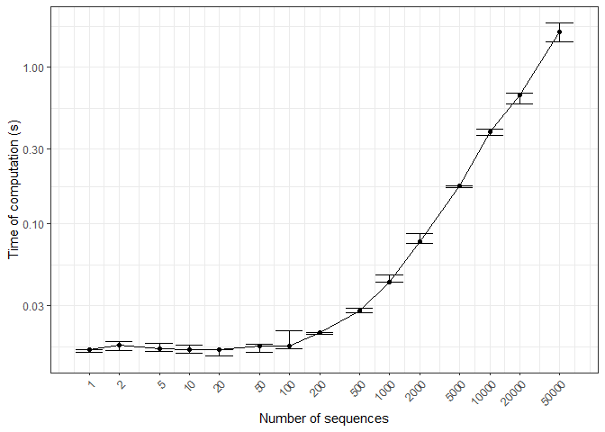

<!-- README.md is generated from README.Rmd. Please edit that file -->

# Mixture of Markov Chain with Support of Higher Orders and Multiple Sequences

<!-- badges: start -->

[](https://lifecycle.r-lib.org/articles/stages.html#experimental)
[](https://CRAN.R-project.org/package=markovmix)
[](https://github.com/zhuxr11/markovmix/actions)
[](https://app.codecov.io/gh/zhuxr11/markovmix?branch=master)
<!-- badges: end -->

**Package**: [*markovmix*](https://github.com/zhuxr11/markovmix)
0.1.0<br /> **Author**: Xiurui Zhu<br /> **Modified**: 2023-04-16
22:24:19<br /> **Compiled**: 2023-04-16 22:24:24

The goal of `markovmix` is to fit mixture of Markov chains of higher
orders from multiple sequences. It is also compatible with ordinary
1-component, 1-order or single-sequence Markov chains. In addition to
the fit function, custom print and predict functions are also provided.
Core functions are written with `Rcpp` to efficiently process sequences
and probabilities.

## Installation

You can install the released version of `markovmix` from
[CRAN](https://cran.r-project.org/) with:

``` r
install.packages("markovmix")
```

Alternatively, you can install the developmental version of `markovmix`
from [github](https://github.com/) with:

``` r
remotes::install_github("zhuxr11/markovmix")
```

## Examples of fitting (mixture of) Markov chains

Before start, we generate some sequences with a finite set of states,
just as those to fit a Markov chain.

``` r
library(markovmix)
```

``` r
library(purrr)

# Define Markov states
mk_states <- LETTERS[seq_len(4L)]
# Define number of sequences
mk_size <- 100L
# Define sequence length range
mk_len_range <- seq_len(10L)
# Define a helper function to generate sequence list
gen_seq_list <- function(size, len_range, states, seed = NULL) {
  if (is.null(seed) == FALSE) {
    set.seed(seed)
  }
  purrr::rerun(.n = size, sample(states, sample(len_range, 1L), replace = TRUE))
}
mk_seq_list <- gen_seq_list(size = mk_size, len_range = mk_len_range, states = mk_states, seed = 1111L)
head(mk_seq_list)
#> [[1]]
#> [1] "B" "B" "D" "A" "B" "B"
#> 
#> [[2]]
#>  [1] "C" "C" "D" "C" "C" "A" "A" "B" "D" "B"
#> 
#> [[3]]
#> [1] "C" "A"
#> 
#> [[4]]
#> [1] "A"
#> 
#> [[5]]
#> [1] "A" "D" "B" "B"
#> 
#> [[6]]
#> [1] "A" "B"
```

First, we fit a 1-order Markov chain, the most commonly used type.

``` r
mk_fit <- fit_markov_mix(seq_list = mk_seq_list, states = mk_states)
#> Fitting Markov chain with a single (non-mixture) component ...
print(mk_fit)
#> This is a 1-order Markov chain.
#> Transition matrix:
#>           A         B         C         D
#> A 0.2149533 0.2616822 0.2803738 0.2429907
#> B 0.2200000 0.2400000 0.2500000 0.2900000
#> C 0.2232143 0.2232143 0.2142857 0.3392857
#> D 0.2803030 0.2272727 0.2196970 0.2727273
```

Then, we fit a 2-order Markov chain.

``` r
mk_fit2 <- fit_markov_mix(seq_list = mk_seq_list, order. = 2L, states = mk_states)
#> Fitting Markov chain with a single (non-mixture) component ...
print(mk_fit2)
#> This is a 2-order Markov chain.
#> Transition matrix:
#>              A         B          C         D
#> A->A 0.1500000 0.3500000 0.20000000 0.3000000
#> A->B 0.1500000 0.2000000 0.25000000 0.4000000
#> A->C 0.3600000 0.2000000 0.16000000 0.2800000
#> A->D 0.2000000 0.2500000 0.25000000 0.3000000
#> B->A 0.3125000 0.1250000 0.31250000 0.2500000
#> B->B 0.2352941 0.4117647 0.05882353 0.2941176
#> B->C 0.2380952 0.2380952 0.23809524 0.2857143
#> B->D 0.3928571 0.1785714 0.28571429 0.1428571
#> C->A 0.2000000 0.2000000 0.30000000 0.3000000
#> C->B 0.2941176 0.1764706 0.35294118 0.1764706
#> # ... 6 more rows in transition matrix ...
```

Finally, we fit a 3-component mixture of 2-order Markov chain, with
randomly generated soft clustering probabilities for each sequence.

``` r
# Define number of components
mk_n_comp <- 3L
set.seed(2222L)
mk_clusters <- matrix(runif(length(mk_seq_list) * mk_n_comp), nrow = length(mk_seq_list), ncol = mk_n_comp)
mk_mix_fit2 <- fit_markov_mix(seq_list = mk_seq_list, order. = 2L, states = mk_states, clusters = mk_clusters)
print(mk_mix_fit2)
#> This is a 3-component mixture of 2-order Markov chains.
#> 
#> Component 1: prior = 0.312888
#> Transition matrix:
#>              A         B          C         D
#> A->A 0.1169575 0.3560494 0.26867335 0.2583198
#> A->B 0.1801687 0.2006756 0.26776742 0.3513882
#> A->C 0.3175922 0.1573649 0.23078407 0.2942588
#> A->D 0.1358512 0.2751465 0.24779010 0.3412122
#> B->A 0.4378156 0.1175067 0.29539207 0.1492856
#> B->B 0.2220438 0.4673616 0.06273356 0.2478610
#> B->C 0.2186025 0.2576454 0.18613038 0.3376218
#> B->D 0.3619600 0.1604362 0.30587425 0.1717296
#> C->A 0.2081094 0.2091141 0.26581457 0.3169619
#> C->B 0.2241448 0.2723052 0.37160938 0.1319407
#> # ... 6 more rows in transition matrix ...
#> 
#> Component 2: prior = 0.3381894
#> Transition matrix:
#>              A          B          C         D
#> A->A 0.1284956 0.28940102 0.20291519 0.3791882
#> A->B 0.1494962 0.15719777 0.24873975 0.4445663
#> A->C 0.4032066 0.18631877 0.05041149 0.3600631
#> A->D 0.2402465 0.22915456 0.24384583 0.2867531
#> B->A 0.3800856 0.14277417 0.28533119 0.1918090
#> B->B 0.3253459 0.33919984 0.07325431 0.2622000
#> B->C 0.2571920 0.19865143 0.28364481 0.2605117
#> B->D 0.3926727 0.27259883 0.21574191 0.1189866
#> C->A 0.2288604 0.14285117 0.34930011 0.2789883
#> C->B 0.3115808 0.08716351 0.42956036 0.1716953
#> # ... 6 more rows in transition matrix ...
#> 
#> Component 3: prior = 0.3489226
#> Transition matrix:
#>              A         B          C         D
#> A->A 0.2051834 0.4167474 0.13506052 0.2430087
#> A->B 0.1258860 0.2345703 0.23658900 0.4029547
#> A->C 0.3503198 0.2525063 0.21698667 0.1801872
#> A->D 0.2103403 0.2498628 0.25618225 0.2836147
#> B->A 0.1629778 0.1125546 0.35050154 0.3739660
#> B->B 0.2046440 0.3642686 0.04421507 0.3868723
#> B->C 0.2359215 0.2675052 0.23949290 0.2570804
#> B->D 0.4199552 0.1183054 0.32474985 0.1369896
#> C->A 0.1519873 0.2706479 0.26459748 0.3127674
#> C->B 0.3504087 0.1767036 0.24180454 0.2310832
#> # ... 6 more rows in transition matrix ...
```

## Examples of predicting (mixture of) Markov chains

Before start, we generate some sequences for prediction.

``` r
mk_pred_seq_list <- gen_seq_list(size = 50L, len_range = mk_len_range, states = mk_states, seed = 3333L)
```

We predict the probabilities of each sequence in the generated mixture
of Markov chains.

``` r
mk_pred_res <- predict(mk_mix_fit2, newdata = mk_pred_seq_list)
print(mk_pred_res)
#>  [1] 1.639309e-06 3.880964e-11 5.281490e-12 8.287293e-03 1.023981e-10
#>  [6] 2.315672e-06 3.419894e-16 2.915650e-08           NA           NA
#> [11] 9.471247e-16 1.161261e-06           NA           NA           NA
#> [16]           NA 1.104972e-02           NA 2.626432e-06 8.629270e-05
#> [21] 3.479030e-10 3.570214e-06           NA           NA 4.716812e-14
#> [26] 6.181362e-10 1.657459e-02 1.676623e-15 1.627125e-04 1.657459e-02
#> [31] 8.628120e-14 1.516558e-11 2.091486e-04           NA           NA
#> [36] 1.761121e-08           NA 1.436631e-06 2.683899e-10 3.366557e-14
#> [41] 8.629270e-05 1.516558e-11 1.654050e-06 5.716979e-16 1.761121e-08
#> [46] 3.977422e-06 2.829365e-08 5.716979e-16 6.056879e-06 1.933702e-02
```

Please note that `NA` values are assigned to the probabilities of
sequences if no valid sub-sequences (e.g. those of length 3 or longer).

``` r
print(purrr::map_int(mk_pred_seq_list[is.na(mk_pred_res) == TRUE], length))
#>  [1] 2 2 1 2 2 1 2 2 2 2 1 2
```

To predict the sequences in each component of the mixture of Markov
chains, we can use `aggregate. = FALSE`.

``` r
mk_pred_res_comp <- predict(mk_mix_fit2, newdata = mk_pred_seq_list, aggregate. = FALSE)
print(head(mk_pred_res_comp, n = 10L))
#>               [,1]         [,2]         [,3]
#>  [1,] 2.605631e-06 2.093227e-06 3.328286e-07
#>  [2,] 1.935684e-11 6.330751e-11 3.250917e-11
#>  [3,] 2.994258e-12 5.097255e-12 7.511077e-12
#>  [4,] 5.990195e-03 8.100510e-03 1.052820e-02
#>  [5,] 3.913193e-11 1.625380e-10 1.008407e-10
#>  [6,] 2.505221e-06 3.911620e-06 5.988444e-07
#>  [7,] 7.795046e-17 4.382439e-16 4.854665e-16
#>  [8,] 3.447336e-08 5.003748e-08 4.150059e-09
#>  [9,]           NA           NA           NA
#> [10,]           NA           NA           NA
```

## Time of computation

The core functions of `markovmix` are written with `Rcpp` to efficiently
process sequences and probabilities. Here, time of computation is
profiled with the number of sequences.

``` r
# Define sequence lengths for ToC profiling
mk_toc_seq_len <- as.integer(outer(c(1L, 2L, 5L), 10^(seq_len(5L) - 1L)))
set.seed(4444L)
mk_toc_seq_list <- purrr::map(
  mk_toc_seq_len,
  ~ gen_seq_list(size = .x, len_range = mk_len_range, states = mk_states)
)
mk_toc_clusters <- purrr::map(
  mk_toc_seq_len,
  ~ matrix(runif(.x * mk_n_comp), nrow = .x, ncol = mk_n_comp)
)
# Define repetition times for ToC profiling
mk_toc_n_times <- 5L
mk_toc <- purrr::map2(
  mk_toc_seq_list,
  mk_toc_clusters,
  ~ purrr::rerun(.n = mk_toc_n_times, {
    system.time(fit_markov_mix(.x, order. = 2L, states = mk_states, clusters = .y, verbose = FALSE))[["elapsed"]]
  }) %>%
    purrr::flatten_dbl()
)
```

``` r
ggplot2::ggplot(tibble::tibble(seq_len = rep(mk_toc_seq_len, each = mk_toc_n_times),
                               toc = unlist(mk_toc)) %>%
                  dplyr::group_by(seq_len) %>%
                  dplyr::summarize(toc_mean = mean(toc, na.rm = TRUE),
                                   toc_sd = sd(toc, na.rm = TRUE),
                                   .groups = "drop"),
                ggplot2::aes(x = seq_len, y = toc_mean)) +
  ggplot2::geom_line() +
  ggplot2::geom_point() +
  ggplot2::geom_errorbar(ggplot2::aes(ymin = pmax(toc_mean - toc_sd, 1e-4),
                                      ymax = toc_mean + toc_sd)) +
  ggplot2::scale_x_log10(breaks = mk_toc_seq_len) +
  ggplot2::scale_y_log10() +
  ggplot2::theme_bw() +
  ggplot2::theme(axis.text.x = ggplot2::element_text(angle = 45, hjust = 1, vjust = 1)) +
  ggplot2::labs(x = "Number of sequences", y = "Time of computation (s)")
```


